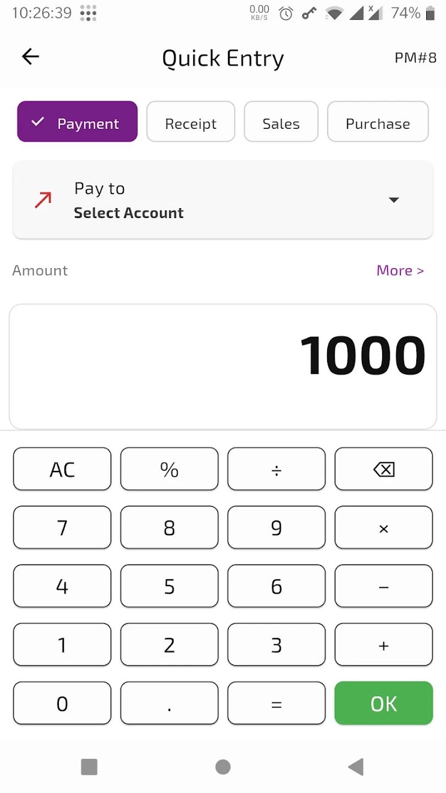
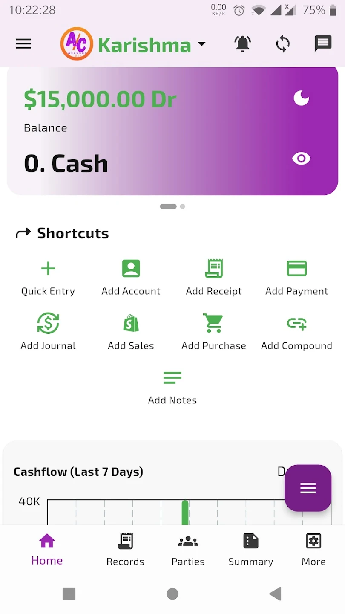
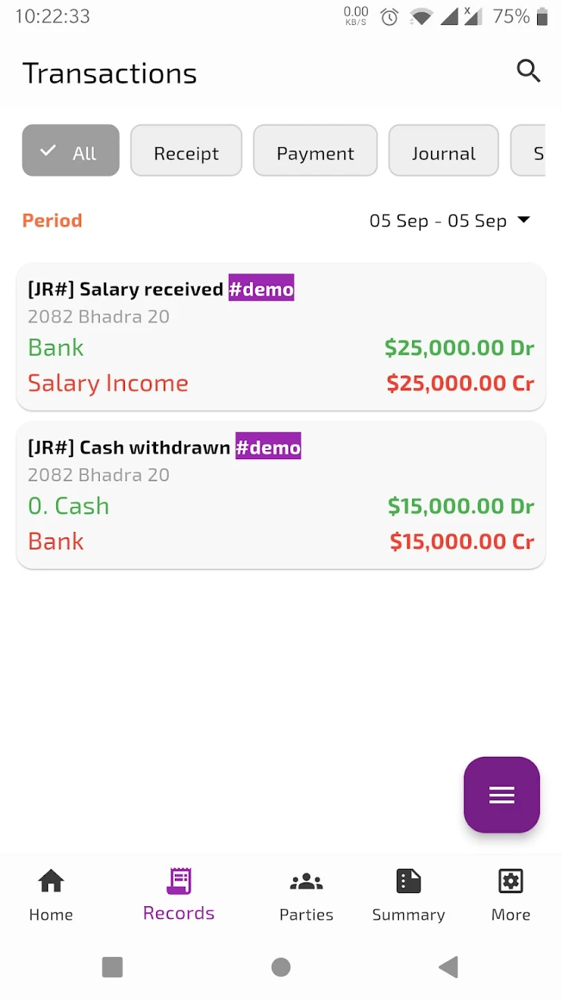
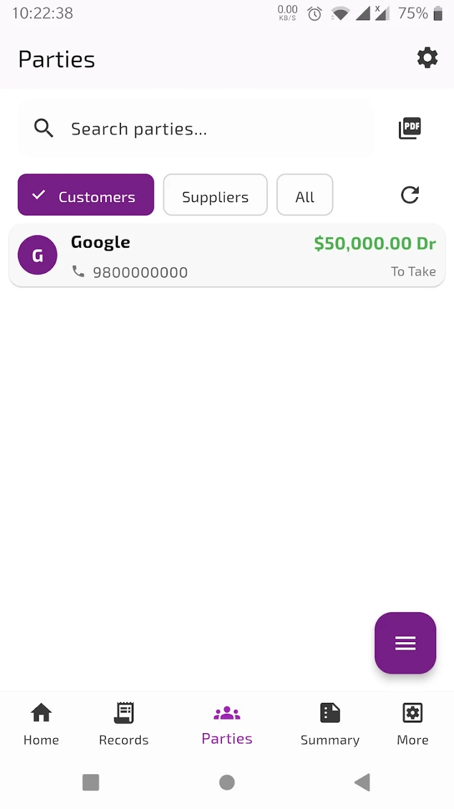
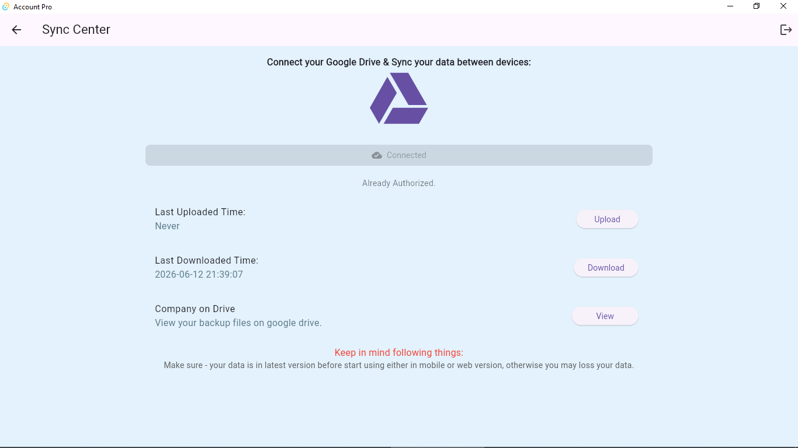
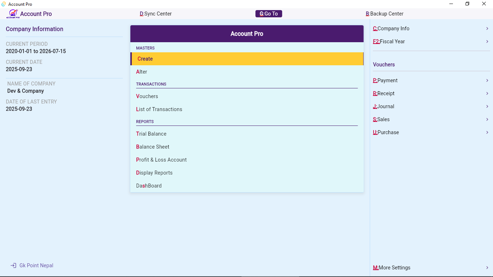
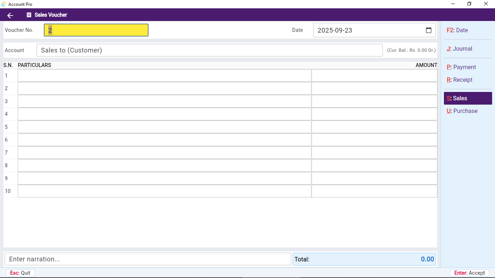
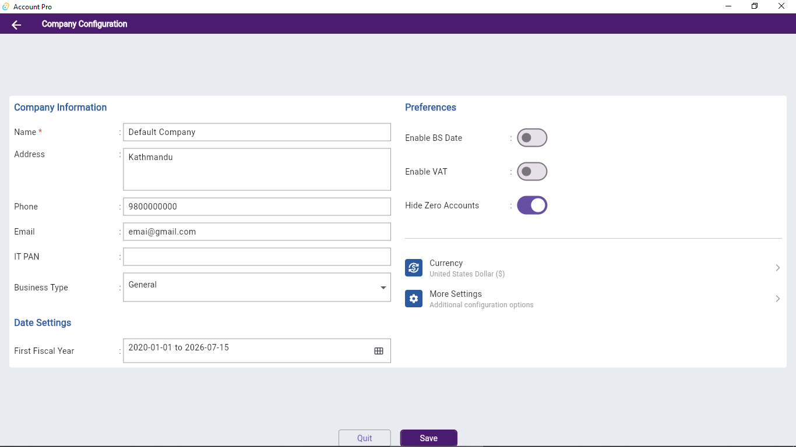

<div align="center">


# Account Pro: Account Manager

**Double-Entry Accounting, Simplified.**  
Track your net worth, manage accounts, and keep your books balanced — fully offline.

[](https://play.google.com/store/apps/details?id=com.edev.accountsir)
[](https://github.com/edev2/accountpro/tree/main/releases)
[](https://play.google.com/store/apps/details?id=com.edev.accountsir)
[](https://play.google.com/store/apps/details?id=com.edev.accountsir)
[](https://play.google.com/store/apps/details?id=com.edev.accountsir)

</div>

---

## 📸 Screenshots

### 📱 Mobile (Android)

<!-- Replace the src values below with your actual screenshot paths, e.g. assets/screenshots/mobile-dashboard.png -->

<div align="center">
<table>
  <tr>
    <td align="center">
      
      <br/><sub>Quick Entry</sub>
    </td>
    <td align="center">
      
      <br/><sub>Dashboard</sub>
    </td>
    <td align="center">
      
      <br/><sub>Add Transaction</sub>
    </td>
    <td align="center">
      
      <br/><sub>Reports</sub>
    </td>
  </tr>
</table>
</div>

### 🖥️ Desktop (Windows / Mac / Linux)

<!-- Replace the src values below with your actual desktop screenshot paths -->

<div align="center">
<table>
  <tr>
    <td align="center">
      
      <br/><sub>Data Syncing</sub>
    </td>
    <td align="center">
      
      <br/><sub>Dashboard</sub>
    </td>
  </tr>
  <tr>
    <td align="center">
      
      <br/><sub>Voucher Entry</sub>
    </td>
    <td align="center">
      
      <br/><sub>Company Creation</sub>
    </td>
  </tr>
</table>
</div>

---

## 📌 What is Account Pro?

_While searching for a mobile accounting app, I found many options — but very few adhered to the principles of the **double-entry accounting system**. Accounting is everywhere, and people increasingly want to keep track of their wealth and financial well-being. That realization inspired this app.

Account Pro is built with the **double-entry system at its core**, allowing users to create as many accounts as needed — ensuring accurate financial tracking and better insights into their finances.

---

## 📦 Download

| Platform | Link |
|---|---|
| 🤖 **Android** | [Google Play Store](https://play.google.com/store/apps/details?id=com.edev.accountsir) |
| 🖥️ **Desktop** (Windows / Mac / Linux) | [GitHub Releases](https://github.com/edev2/accountpro/tree/main/releases) |

> ℹ️ The desktop version runs on Windows, macOS, and Linux. Head to the [releases page](https://github.com/edev2/accountpro/tree/main/releases) and download the installer for your platform.

---

## ✨ Features

| Category | Features |
|---|---|
| 📒 **Accounting** | Double-entry system, account groups, unlimited accounts |
| 💸 **Transactions** | Easy mode entry, recurring transactions, planned transactions |
| 📊 **Reports** | View & print ledgers, net worth tracker, expense manager |
| 📂 **Data** | Import/export via Excel, backup & restore database |
| 🏢 **Multi-entity** | Switch between companies, multi-device support (mobile + web + desktop) |
| 🔍 **Usability** | Easy search mode, fully offline, auto backup |
| 📚 **Learning** | Notes and slides for basic accounting knowledge |

---

## ⚖️ The Double-Entry Principle

Every transaction in Account Pro creates **two matching entries** — a debit and a credit — keeping your books in perfect balance at all times.

```
┌─────────────────────────────────────────────────┐
│           JOURNAL ENTRY EXAMPLE                 │
├─────────────────────────┬───────────┬───────────┤
│ Account                 │  Dr (₨)   │  Cr (₨)   │
├─────────────────────────┼───────────┼───────────┤
│ Cash Account            │  25,000   │           │
│     Sales Account       │           │  25,000   │
├─────────────────────────┼───────────┼───────────┤
│ Bank Account            │  10,000   │           │
│     Loan Account        │           │  10,000   │
├─────────────────────────┼───────────┼───────────┤
│ Total                   │  35,000   │  35,000 ✅ │
└─────────────────────────┴───────────┴───────────┘
        Debits ALWAYS equal Credits — guaranteed.
```

---

## 🔒 Privacy & Data Safety

- ✅ **No data shared** with third parties
- ✅ **No data collected** from users
- ✅ Data is **encrypted in transit**
- ✅ You can **request data deletion** at any time
- ✅ **Zero ads** while you use the app — we promise

---

## 🗺️ Roadmap

- [x] Double-entry accounting system
- [x] Multi-device support (mobile + web + desktop)
- [x] Recurring & planned transactions
- [x] Excel import/export
- [x] Multiple company support
- [ ] Complex journal entries (sales/purchase with tax)
- [ ] More financial charts and reports
- [ ] Budgeting module
- [ ] What do *you* want next? [Let us know →](mailto:gkpointnepal@gmail.com)

---

## ⭐ User Reviews

> *"User friendly and good reporting layout compared with other apps. The developer has made great improvements since launch. Amazing!"*  
> — **Play Store User**, December 2025

> *"The app is excellent. I'm happy to use it. Overall amazing work from the development team."*  
> — **Hures Mohammed**, March 2025

> *"Very useful for study. Helped me a lot understanding accounting concepts."*  
> — **Ram Chandra Shrestha**, February 2023

---

## 📬 Contact & Support

| | |
|---|---|
| 🌐 **Website** | [edevpandey.com.np](http://www.edevpandey.com.np) |
| 📧 **Email** | [gkpointnepal@gmail.com](mailto:gkpointnepal@gmail.com) |
| 🔏 **Privacy Policy** | [View Policy](https://sites.google.com/view/accsir/privacy-policy) |
| 📦 **Package ID** | `com.edev.accountsir` |

---

## ⚠️ Disclaimer

Please use this app at your own discretion. While we strive to provide accurate and reliable features, we cannot guarantee the completeness or accuracy of the information. We are not responsible for any financial damages or losses that may occur as a result of using this app. This app does not represent any government entity.

---

<div align="center">

Made with ❤️ in Nepal by [Dev Pandey](http://www.edevpandey.com.np)

</div>
